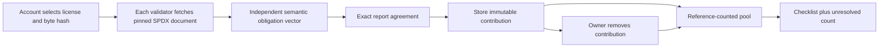
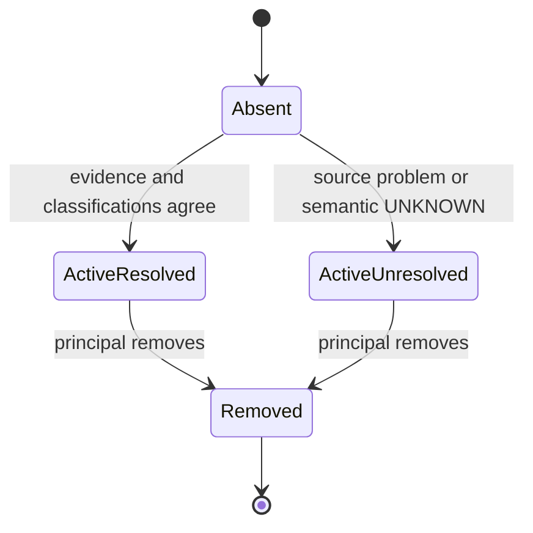

# LicenseObligationPool

A reusable GenLayer **reversible obligation multiset**. Independently interpreted license documents contribute reference counts to a pooled review checklist. Removing an entry reverses exactly its stored contribution without clearing obligations still imposed by other active entries.

## Why GenLayer

Ordinary chains can add counters but cannot independently read and semantically interpret conditional license language. Caller-provided tags would determine the result without evidence. This contract fetches complete SPDX template bytes inside the nondeterministic flow; each validator independently refetches and reinterprets the same text. Exact equality of the complete source-bound report is required. There is no confidence threshold or numerical tolerance.

The consequential AI output controls which counters increase and which checklist items remain after removal. This is not a renamed graph: no nodes, edges, proposal transitions, certificate, execution permission or consumable token exists.



## Four bounded features

For redistribution in source or binary form, potentially modified: COPYRIGHT_NOTICE, LICENSE_TEXT, CHANGE_NOTICE, NONENDORSEMENT. A feature is YES if expressly imposed in any relevant redistribution branch, NO if absent from the complete document, or UNKNOWN if unreliable. Any UNKNOWN leaves the whole entry unresolved; its apparent YES labels are not partially applied. Wrong commitments, invalid encoding and HTTP failures also produce unresolved entries when an observation report is obtained. Network exceptions or validator disagreement may prevent the transaction from committing at all. Malformed model output forces failure/rotation rather than being agreed as valid evidence.

These four features are **not exhaustive legal requirements, license compatibility, an authorization to distribute, or legal advice**. This is a review tool. It does not establish package-to-license attribution, ownership, exceptions, patent permissions, actual fulfillment or applicability. A caller selects documents, not independently verified package dependencies. COMPLETE means only that all currently selected entries have these four classifications, not that a software release is compliant.

## Accounting and lifecycle

Pools and slots are namespaced by sender address and pool ID. Only that principal can add/remove its entries. Slot IDs cannot be reused, including after removal. At most 32 entries can be active in a pool. Counters are updated in four bounded operations; removal uses stored evidence, never a new AI guess. Queries do not scan the full history.



Coverage is EMPTY with no active entries, PARTIAL with any unresolved entries, otherwise COMPLETE. An empty set is never reported as complete. To correct an entry, remove it and add a new slot; immutable reports and chained events preserve both actions. There is no silent edit/reset privilege.

## Evidence pinning and limits

URLs are constructed under the SPDX license-list-data repository at revision `31ba1a50e5397e00a304dbadc76531740e89ee48`. Supported templates: MIT, BSD-2-Clause, BSD-3-Clause, Apache-2.0, ISC. Caller-controlled hosts and path traversal are excluded. SHA-256 is computed over the entire HTTP response before decoding; source size is limited to 18,000 bytes. The complete decoded text is retained in the immutable report, not merely a hash or self-reported summary.

This is historical source binding, not a claim of present-world freshness. A different publisher revision requires a new deployment. Hashes bind evidence but do not prove semantic correctness; shared model mistakes and publisher compromise remain trust assumptions.

## API

- `add(pool_id, slot_id, license_id, expected_hash)` — independently observe and add a contribution.
- `remove(pool_id, slot_id)` — reverse the caller's active contribution.
- `get_pool(account, pool_id)` — counts, coverage, selected obligations, journal root.
- `get_entry(account, pool_id, slot_id)` — immutable full evidence report and active flag.
- `history(account, pool_id, offset, limit)` — at most 20 immutable events.

## Install, test and deploy

```powershell
python -m venv .venv
.venv/Scripts/python.exe -m pip install -r requirements.txt
.venv/Scripts/genvm-lint.exe check contracts/LicenseObligationPool.py
.venv/Scripts/pytest.exe tests -q
npm install -g genlayer@0.39.2
npm install --ignore-scripts
genlayer network set studionet
genlayer account use YOUR_ENCRYPTED_DEDICATED_ACCOUNT
genlayer deploy --contract contracts/LicenseObligationPool.py
node scripts/inspect_source.mjs MIT BSD-3-Clause
genlayer write CONTRACT add --args demo mit MIT MIT_HASH
genlayer write CONTRACT add --args demo bsd BSD-3-Clause BSD_HASH
node scripts/read_pool.mjs CONTRACT YOUR_ADDRESS demo mit bsd
genlayer write CONTRACT remove --args demo bsd
node scripts/studio_check.mjs --source CONTRACT
node scripts/studio_check.mjs --success TX_HASH
```

StudioNet is gasless. Use an encrypted dedicated account; never paste/export a private key. Wait for each receipt before sending the next write. FINALIZED is not execution success: inspect execution results separately. The test suite uses mocked web/model responses and direct mode does not run network validator callbacks. See [LIVE_PROOFS.md](LIVE_PROOFS.md) for actual consensus integration results, not planned proofs.

Use the SDK reader for account-string view arguments: CLI 0.39.2 automatically encodes address-looking arguments as Address rather than string. The script preserves the view's declared argument type and requires no signing key.

See [architecture](docs/architecture.md) and [security](SECURITY.md). This deployment is experimental and unaudited.
